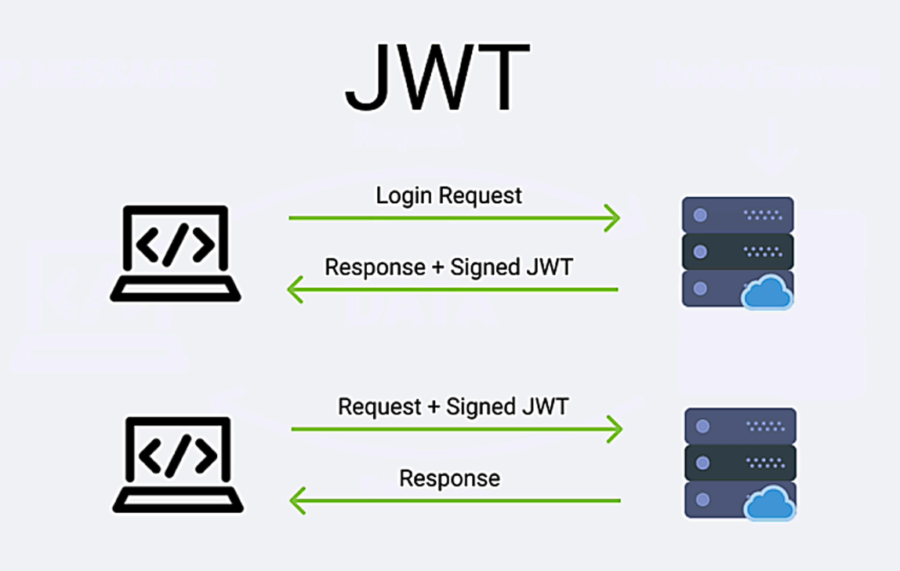

# JWT Basic

JSON Web Tokens (JWT) are an open, industry-standard method for securely transmitting information between parties as a JSON object. They are widely used for authentication and authorisation purposes in modern web applications.

[JWT - JSON Web Tokens](https://jwt.io/)

## JSON Web Token (JWT)

**Definition and Purpose**:

- JSON Web Token (JWT) is an open standard (RFC 7519).
- Defines a compact and self-contained way to securely transmit information between parties as a JSON object.
- Information is verified and trusted because it is digitally signed.

**Signing Algorithms**:

- JWTs can be signed using:
  - A secret with the HMAC algorithm.
  - A public/private key pair using RSA or ECDSA.

**Encryption**:

- JWTs can be encrypted for secrecy between parties.
- Focus on signed tokens:
  - Signed tokens verify the integrity of the claims within.
  - Encrypted tokens hide claims from other parties.
  - When using public/private key pairs, the signature certifies that only the party holding the private key signed it.

### A typical JWT consists of three parts:

1. **Header**: Specifies the type of token (JWT) and the signing algorithm used (e.g., HMAC SHA256).
2. **Payload**: Contains the claims or statements about an entity (typically, the user) and additional data. This is where user information or other data can be stored.
3. **Signature**: Created by encoding the header and payload using a secret key or a public/private key pair, which ensures the token's integrity and authenticity.

JWTs are compact, self-contained, and can be easily passed in URLs, HTTP headers, or inside a POST parameter, making them versatile for different use cases. They are widely adopted in RESTful APIs and Single Page Applications (SPAs) for secure and efficient token-based authentication.

This image illustrates how JWTs are used to securely transmit information between a client and a server, ensuring that the client is authenticated and authorised to access certain resources. This process helps maintain secure communication and verifies the identity of the client.

1. **Login Process**:

   - The client sends a "Login Request" to the server.
   - The server responds with a "Response + Signed JWT".

2. **Subsequent Requests Using the JWT**:
   - The client sends a "Request + Signed JWT" to the server.
   - The server responds with a "Response".

### JWT Secret Key

**JWT Secret Key**:

- The secret key in JSON Web Tokens (JWT) is used to sign the token, ensuring its authenticity and integrity.
- When a JWT is created, the header and payload are combined and then signed using the secret key.
- The signature is used to verify that the token has not been altered since it was issued.

### Importance of a Long, Strong, and Complex Secret Key

A long, strong, and complex secret key is crucial for several reasons:

1. **Security**: A strong secret key makes it significantly harder for attackers to guess or brute-force the key, thereby preventing unauthorised access to the JWT.
2. **Integrity**: A complex secret key ensures that the JWT cannot be easily forged or tampered with. Only entities that possess the correct secret key can create a valid token.
3. **Resistance to Attacks**: A long and complex secret key increases resistance against common attacks, such as dictionary attacks or brute-force attacks. Short or simple keys are more vulnerable to these types of attacks.
4. **Data Protection**: JWTs often carry sensitive information in their payload. A strong secret key helps protect this information from exposure or manipulation by malicious actors.
